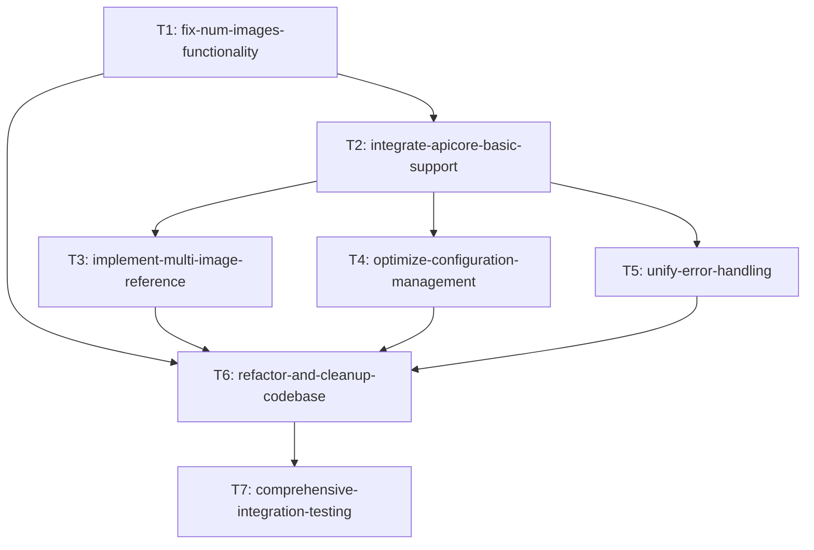

# Task Dependencies and Execution Order

## Dependency Graph



## Execution Phases

### Phase 1: Core Fixes (Critical Path)
**Duration: 2 days**
- **T1: fix-num-images-functionality** (16h, Critical Priority)
  - 依赖: 无
  - 输出: 修复后的批量生成功能
  - 验收: num_images 参数按设定数量生成图片

### Phase 2: Feature Development (Parallel Execution)
**Duration: 2.5-3 days**

#### 主线开发 (Sequential)
- **T2: integrate-apicore-basic-support** (20h, High Priority)
  - 依赖: T1 完成
  - 输出: APICore.ai 基础集成
  - 验收: 新提供商可选择和正常使用

#### 并行开发 (Can run in parallel after T2)
- **T3: implement-multi-image-reference** (12h, Medium Priority)
  - 依赖: T2 完成
  - 输出: 多图片参考功能
  - 验收: 支持多图片 URL 输入格式

- **T4: optimize-configuration-management** (8h, Medium Priority)
  - 依赖: T2 完成
  - 输出: 优化的配置管理
  - 验收: 支持 APICore.ai 密钥配置

- **T5: unify-error-handling** (10h, Medium Priority)
  - 依赖: T2 完成
  - 输出: 统一错误处理机制
  - 验收: 一致的错误信息和处理

### Phase 3: Quality and Validation (Sequential)
**Duration: 3.75 days**

- **T6: refactor-and-cleanup-codebase** (14h, Low Priority)
  - 依赖: T1, T2, T3, T4, T5 全部完成
  - 输出: 清理优化后的代码
  - 验收: 代码行数减少15%，复杂度降低

- **T7: comprehensive-integration-testing** (16h, Critical Priority)
  - 依赖: T6 完成（所有开发任务完成）
  - 输出: 完整测试报告和验证
  - 验收: 100% 测试通过，达到成功标准

## Resource Allocation

### Development Timeline
```
Week 1:
  Days 1-2: T1 (fix-num-images-functionality)
  Days 3-4: T2 (integrate-apicore-basic-support)
  Day 5: T3 start (implement-multi-image-reference)

Week 2:
  Day 1: T3 finish + T4 (optimize-configuration-management)
  Day 2: T5 (unify-error-handling)
  Days 3-4: T6 (refactor-and-cleanup-codebase)
  Day 5: T7 start (comprehensive-integration-testing)

Week 3:
  Days 1-2: T7 finish (comprehensive-integration-testing)
  Day 3: Buffer for issues and final polish
```

### Critical Path Analysis
- **Total Duration**: 86 hours (≈ 10.75 工作日)
- **Critical Path**: T1 → T2 → T6 → T7 (66 hours)
- **Parallel Work**: T3, T4, T5 可在 T2 完成后并行进行

### Risk Mitigation
1. **High Risk Tasks**: T1, T2, T7 - 预留额外时间
2. **Dependencies**: T2 是关键依赖点，影响后续所有任务
3. **Buffer Time**: 预留 20% 时间处理意外问题

## Task Prioritization

### Must Have (Critical)
- T1: fix-num-images-functionality
- T2: integrate-apicore-basic-support
- T7: comprehensive-integration-testing

### Should Have (High)
- T4: optimize-configuration-management
- T5: unify-error-handling

### Could Have (Medium)
- T3: implement-multi-image-reference
- T6: refactor-and-cleanup-codebase

## Delivery Milestones

### Milestone 1: Core Functionality (End of Week 1)
- num_images 功能修复完成
- APICore.ai 基础集成完成
- 基本功能可用

### Milestone 2: Feature Complete (End of Week 2)
- 所有新功能开发完成
- 代码重构和优化完成
- 准备进入测试阶段

### Milestone 3: Production Ready (End of Week 3)
- 所有测试完成
- 达到成功标准
- 可以交付使用